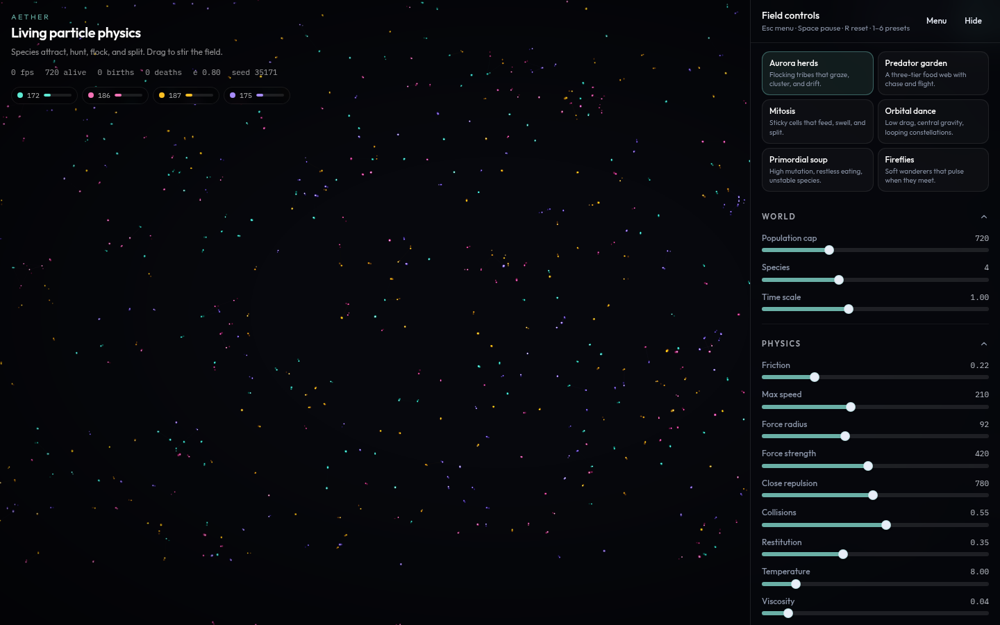

# Aether

Lebendiges Partikelfeld im Browser. Punkte ziehen sich an, stoßen sich ab, fressen, altern und teilen sich.

**Live:** https://markovigele.github.io/aether/



## Start

```bash
npm install
npm run dev
```

Dann http://127.0.0.1:45217 — auf dem Mac: `Aether starten.command`.

Oder einfach den Live-Link öffnen, ohne Installation.

## In der Anwendung

Ziehen mit der Maus: je nach Einstellung anziehen, abstoßen oder neue Punkte setzen. Die Seitenleiste steuert Physik, Arten und Farben.

Auf dem Handy: unten Pause, Panel, Reset. Das Einstellungsblatt bleibt niedrig, das Feld bleibt sichtbar.

| Taste | Wirkung |
| --- | --- |
| `Esc` | Menü öffnen oder schließen |
| `Leertaste` | Pause |
| `R` | Feld zurücksetzen |
| `N` | neues Universum |
| `C` | Seitenleiste ein- oder ausblenden |
| `1`–`6` | Preset laden |
| `Shift`+`1`–`6` | eigener Speicherplatz |

Im Menü (Esc) liegen Qualität, Kurzhilfe und sechs Speicherplätze. Einstellungen bleiben im Browser. Export/Import sichert sie als Datei.

## Lizenz

MIT · INGENIUMOWL
